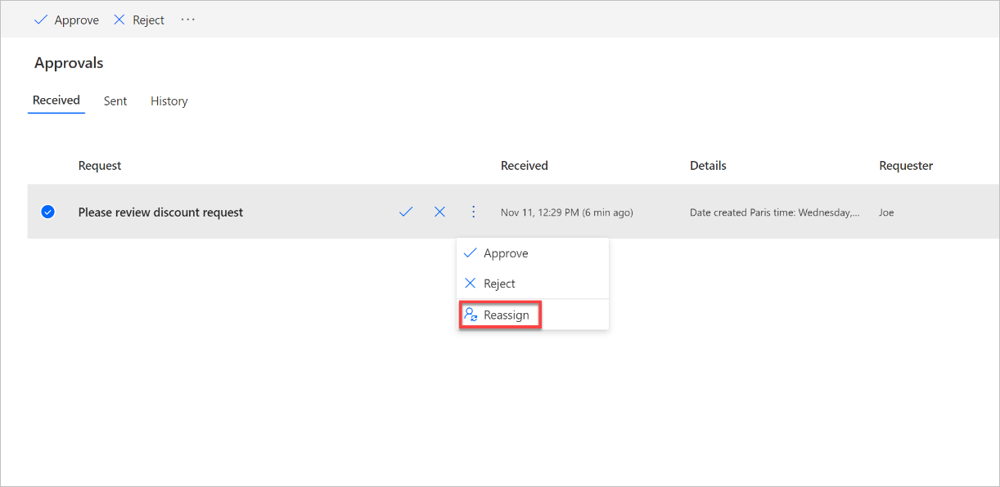
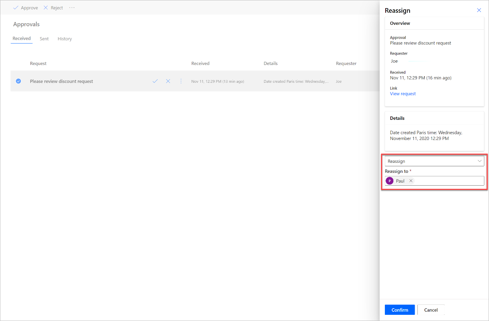

# How to - Top scenarios with approval flows
  
Here are the top *how to* questions and answers about approvals in Power Automate.

## Customize approval requests
  
There are two ways to customize approval requests.

### Using custom options

Power Automate approvals provides two default options to *approve* or *reject* requests. 

Your business might need other options beyond approve/reject. For example, you might be reviewing a discount request and you may want the approver to be able to respond from a list of possible discount limits, including:

   - Up to 5%
   - Up to 10%
   - Up to 15%
   - Denied. 
   
You can customize the list of responses to approval requests by using **Custom Responses**.

Here's an example.

Salespeople in an organization can request an approver to give customers a discount for their purchases. These Salespeople enter the discount request into a SharePoint list, which is the trigger of the flow. The flow then uses custom responses with the **Start and wait for an approval** action.  
  
   

Select as approval type **Custom Responses – Wait for all responses** or **Custom Responses – Wait for one response**, depending on if you need multiple approvers or just one.  
  
Add as many **response options** as needed. In this case we are giving four mentioned earlier.  
  
Give a **Title** to the approval request, and then list the approvers in **Assigned to**.  
  
   

After the approval request is answered, the flow sends an email to the salesperson who requested the discount, informing them about the outcome of the request. 

To get the response to the approval request, just use the **Outcome** output.  
  
   

The approver sees the approval request like this. 
  
   
 
### Using markdown

Markdown is a language that's used to format text into Webpages like headers, tables, or bold text. In an approval request, you can use markdown in the **Details** field to format the information presented to approvers.

You can learn more about how to use markdown and the supported apps in the [Use Markdown in Power Automate approval requests](./approvals-markdown-support.md) article.

Here is an example of its usage. 
  
   

And here's how the approvers see it in a nicely formatted email in Outlook.  
  
   

## Display approval date in my timezone  
  
By default, approval emails display the **Date Created** field in GMT. There no way to change this field.  
  
   

You can work around this by displaying the date the flow was run, in your desired timezone, in the **Details** field of the approval request. For example, to display the approval request date in Paris time, add two time actions like this.  
  
   

And the resulting approval email will look like this:  
  
  

 
## Reassign an approval to another person 
  
If received an approval request, but you want somebody else to make the approval decision, you can reassign the approval to somebody else:  
  
1. Login to the [Power Automate](https://flow.microsoft.com/).

1. On the left navigation bar, select **Approvals**.

1. Hover your mouse over the approval you want to reassign, select the three dots > **Reassign**.

   

   
 

On the other hand, if you are the requester, you cannot reassign the approval request. However, you can **Cancel** the approval request, and then edit the flow to change the **Assigned to** approver. 

To cancel an approval:

1. Login to the [Power Automate](https://flow.microsoft.com/).

1. On the left navigation bar, select **Approvals**.

1. Select the **Sent** tab.

1. Select **Cancel**.

   

## Get a confirmation email once an approval has been answered  
  
If you would like to be notified when an approver responds to an approval request, just send yourself an email after the approval step in the flow. Send the email on the **If yes** and on the **If no** branches of the approval outcome condition like this.

   

## Cancel an approval  
  
If you are the maker of a flow that requests approvals, and the approval requests haven't been answered, you can cancel it by:

1. Login to the [Power Automate](https://flow.microsoft.com/).

1. On the left navigation bar, select **Approvals**.

1. Select the **Sent** tab.

1. Select **Cancel**.

   

## Do sequential approvals  
  
Some processes require pre-approval before the final approver is required to sign off. For example, an organization may have a sequential approval policy that requires pre-approval for invoices over $1,000.00 before they're approved by the Finance department. This [walkthrough guides you on how to manage sequential approvals with Power Automate](./sequential-modern-approvals.md).

## Post an approval request in Microsoft Teams

If you would like to notify the assigned approvers through a message in Microsoft Teams instead of by email, start with the [Request approval in Teams for a selected item in SharePoint template](https://flow.microsoft.com/galleries/public/templates/7d892b1f1dc2479b873268eca6cae58b/request-approval-in-teams-for-a-selected-item-in-sharepoint/) to do it.

## Send an approval to multiple people  
  
You can assign an approval request to multiple persons. Here are the two options. 

1. When adding an approval action, there are two actions options for sending the approval request to multiple persons. Select the appropriate option based on your needs.

   - If only a response of one person from the group of people is enough to sign off the approval and continue with the flow run, use the **Approve/Reject – First to respond** or **Custom Responses – Wait for one response** action.

   - If *Everybody* must respond to the approval request to continue with the flow run, select **Approve/Reject – Everybody must approve** or **Custom Responses – Wait for all responses**.  
      
    

2. In the **Assigned to** field, define the list of persons to whom the approval request should be sent. Separate each person with a semicolon (;).  

   

## Next steps

- Create [approval flows](modern-approvals.md)

 

[!INCLUDE[footer-include](includes/footer-banner.md)]