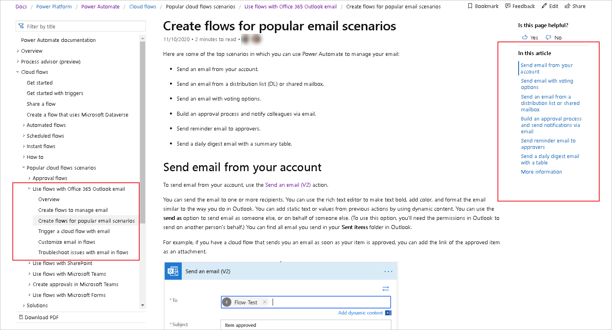

# Get contextual help with flows from the Power Virtual Agents bot

Real-time, in-product help is available from the [documentation](./index.yml) and the Power Virtual Agent bot to solve the most common workflow scenarios. While building your flows, you can access content from the documentation, community, blogs, and templates.

## Use in-product help

>[!NOTE]
>In-product help is available while you create or edit cloud and desktop flows.

1. Select the **?** on a connector, action, or trigger to start the in-product help experience.

   

1. The right pane opens with details about the action and provides documentation links for that action.

   In the following example, the **Send an email (V2)** action is selected, showing help topics regarding the top email scenarios, an overview of the action, and more.

   If you select **?** on a different action, the help pane updates to show guidance documents for the currently selected action.

   >[!TIP]
   >In product help is contextual, always displaying content that's relevant to the currently selected action, trigger, or connector.

   

### Get help from the community

Now that you've displayed the in-product help, follow these steps to use the various topics.

1. Select any link from the list of help topics.

   The corresponding documentation opens.

   

1. Expand the **Community** section.

   The community results about the action are displayed.

   

1. Select an item to go to specific community thread.

   

1. You can also get help from blog posts if you select the **Blog** link.

### Get conversational self-help from the bot

1. Select **Ask a chatbot**.

   The chat bot lists the most requested topics and provides a field that you can use to ask the bot questions.

   

1. Choose one of the topics.

   The bot gives an overview and then provides the next level of topics.

1. Find the right topic.

   The bot provides the steps and links to the corresponding documentation with a detailed explanation, showing examples and images.

   

1. Select **Yes** to indicate that you've found an answer to your question.

1. Select **No** if the bot didn't provide the answer that your're looking for.

   

1. Select **Yes** to check the knowledge database and enter another question.

   

   

1. Select a category to see the corresponding results

   

   

[!INCLUDE[footer-include](includes/footer-banner.md)]
