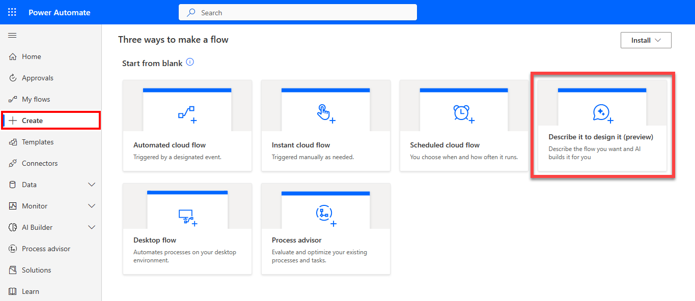
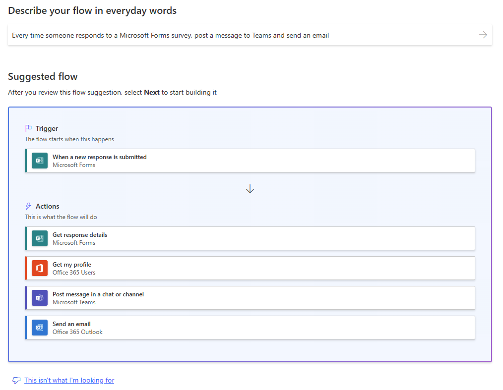
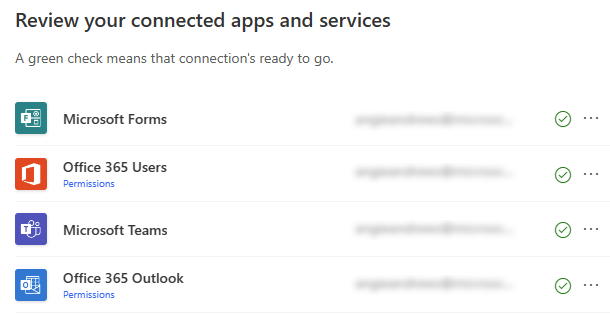

# Create a cloud flow from a description (preview)

[This article is pre-release documentation and is subject to change.]

When you build automation with Power Automate, it might take valuable time to learn which actions and triggers you need, especially if you’re new to the Power Automate. If you want to jump right in and get started, you can just write a description of what you want to automate in everyday language. Power Automate then uses OpenAI Codex to translate your description into code, and then provides a list of corresponding flows that you can create instantly.

> [!IMPORTANT]
>
> - This is a preview feature.
> - [!INCLUDE[cc_preview_features_definition](includes/cc-preview-features-definition.md)]

## Prerequisites

- A work or school account with access to a Power Automate [environment](/power-platform/admin/create-environment#create-an-environment-in-the-power-platform-admin-center) that's based in Europe or the United States.
  
  >[!NOTE]
  >You can't create cloud flows from a description if you're logged in with a Microsoft Account.

  >[!TIP]
  >If you don’t have access to an environment that's based Europe or the United States, you can [create a new environment and select Europe or United States](/power-platform/admin/create-environment#create-an-environment-in-the-power-platform-admin-center) as the region.

- Check current [limitations](#limitations) for more information.

## Create a flow from a description

In the following example, we'll build an automated cloud flow that sends a notification via Teams and an email each time someone responds to a Microsoft Forms survey.

1. Sign in to [Power Automate](https://make.powerautomate.com), select **Create** on the left side of the screen, and then select **You describe it, AI Builds it**.

   >[!div class="mx-imgBorder"]
   >

   A screen opens where you can enter a description of what you want to automate. You will also see examples you can use for inspiration and that you can try right away.

1. For this example, enter *Every time someone responds to a Microsoft Forms survey, post a message to Teams and send an email*.
1. Select the **Confirm** button.

   >[!div class="mx-imgBorder"]
   >

   Power Automate returns a suggested flows that correspond to what you've entered.

   >[!div class="mx-imgBorder"]
   >

   >[!NOTE]
   >If the suggestions doesn't correspond to what you’re looking to automate, you can select **This isn't what I'm looking for**. You will see additional guidance on what you can do next, and this signal helps Microsoft to improve the AI behind this feature.

1. Select **Next**.
1. Setup all the connections needed to run the flow.
   >[!div class="mx-imgBorder"]
   >

1. Select **Next**.
1. Enter the information needed to run the flow. For example, which form to use and to whom to send the Teams message and email. You can decide to fill in the information on this step or do it later in the designer.

1. Select **Create flow**.

   And there you have it! Your flow has been built. Congratulations! You can decide to make any modification and edit the flow or save it and test it.

   >[!div class="mx-imgBorder"]
   >

## Limitations

- Power Automate supports descriptions written in the English language only. Descriptions you write in other languages might work, but they are not supported.
- Cloud flows are the only type of flow that you can create from a description.
- In the current version, the AI might not fill in some parameters automatically, even if you provide them in the description.
- The AI model that transforms a description into a cloud flow is optimized to automate the main actions for the following applications.

  - Microsoft Excel
  - Microsoft Forms
  - Microsoft 365 Outlook
  - Microsoft OneDrive for Business
  - Microsoft Planner
  - Microsoft SharePoint
  - Microsoft Teams
  - Approvals
  - Microsoft Dataverse
  
### See also

[Learn more about cloud flows](./overview-cloud.md).  
