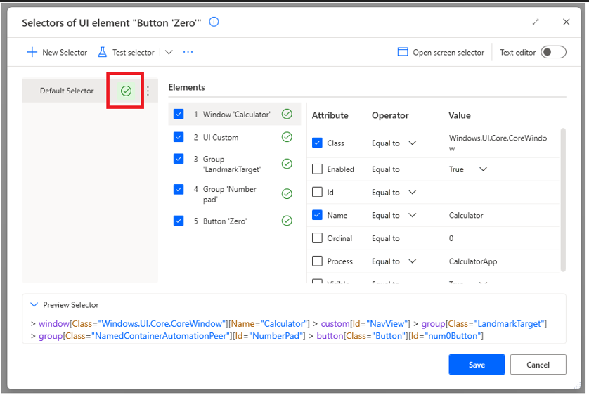
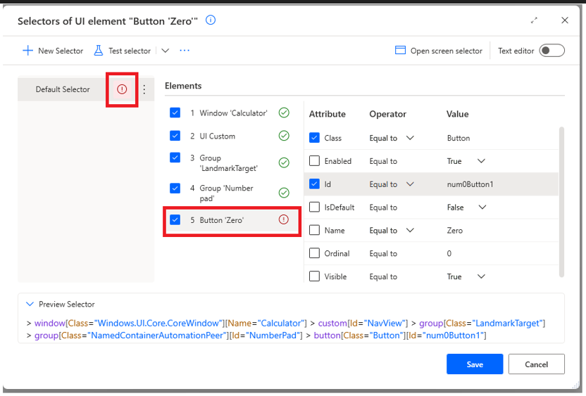
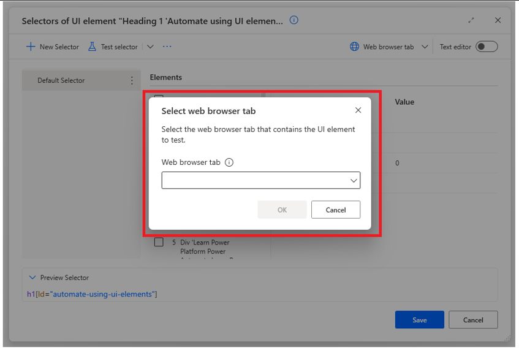
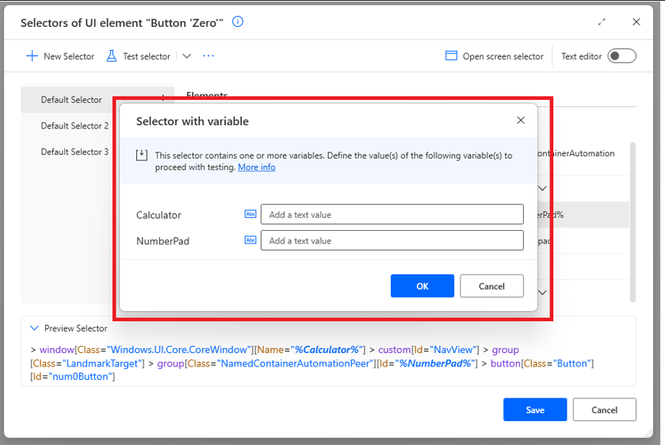
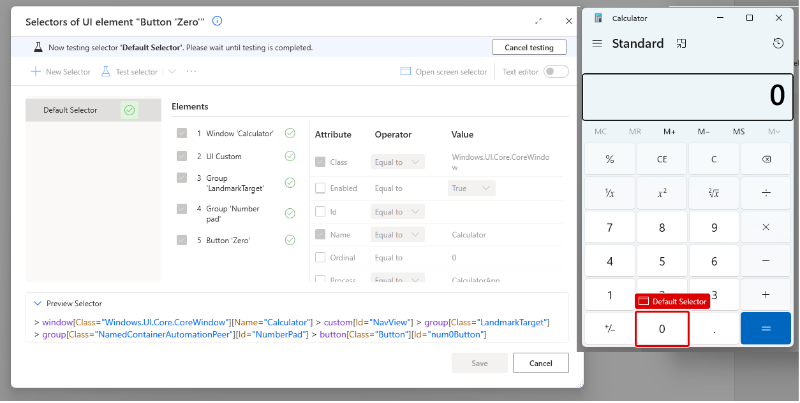
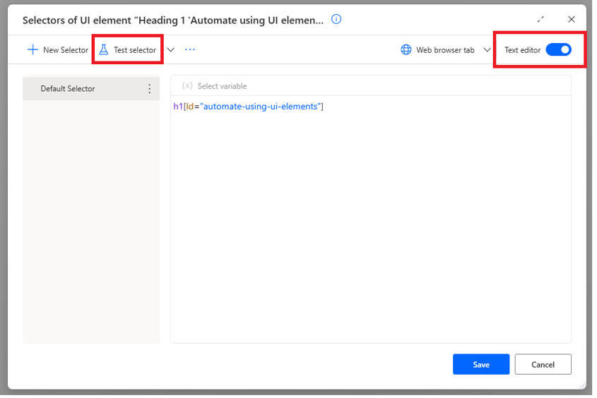

# Test a selector

Power Automate enables you to test a selector and ensure that your UI automation flows are running as expected. With the ability to test both desktop and web selectors, you can quickly and efficiently automate your application and webpage interactions.  

The selector builder window is used to edit UI elements. There, you can find the option for testing the selector. Select **Test selector** and Power Automate checks whether the selected selector from the list can locate a UI element on the screen.

<!--  -->

In order to test a selector, you must ensure that a UI element is available in your machine. If one isn't available, after selecting **Test selector** the message **Ensure that the UI element is present in the screen before proceeding with the validation** is displayed.

<!-- Screenshot of messages arent localizable or accessbile  -->

There are three possible outputs: 
* **Success:** A UI element was found successfully in the screen. 

  

* **Failed:** No UI element was found in the screen. Power Automate highlights the element (level) that wasn't found in the **Elements** list, indicating to the user the element that should be fixed.

  

* **Multiple UI elements found:** The selector may locate multiple UI elements in the screen. If a UI element is used in an action, at runtime Power Automate interacts with the first respective UI element from the top left corner of the screen. Note that Power Automate highlights at testing the UI element that will be interacted at the runtime if the specific selector is used in an action.

  

You may get more information for each output by selecting the output icon next to the tested selector.  

You can test selectors for both desktop and web UI elements. Desktop selectors are captured from any Windows application and can be used in actions of the UI automation group. Web selectors are captured from webpages and can be used only in browser automation actions.  

> [!NOTE]
> Every time you edit a tested selector, the output icon is removed, and selector should be tested again.  

## Testing all selectors

A UI element may have more than one selector for defining its location. The test selector feature allows you to test all selectors by selecting the arrow next to **Test selector**, and then selecting **Test all selectors**.

<!--  -->

> [!NOTE]
> When you opt for testing all selectors, the disabled selectors won't be tested from the list. In case you need to test a disabled selector, test it individually.  

## Desktop UI elements - Open screen selector

Each desktop UI element belongs to a screen (parent UI element). In some cases, testing of the selector can't be performed because the screen can't be found. In this case, you should: 

- Ensure that the screen is available in your machine. 
- If yes, then select **Open screen selector**, and fix the screen selector. You may perform the test selector feature to the screen selector as well.  

<!--  -->

> [!NOTE]
> When you navigate to the screen selector through the selector builder window of a child, then you will return to the child view after closing the screen's selector builder window.

## Web UI elements - Open Web browser tab

If there's a web UI element, in order to proceed with the test the web page that contains the specific UI element must be available in your machine and the web browser tab should be selected in the **Web browser tab** drop-down list.
 
<!-- 

  -->

If no web browser tab is selected in the list and you select **Test selector**, Power Automate prompts you to select the browser tab before the testing starts.

## Variables 

You can test a selector even if one or more variables are contained in the selector. You must provide values to the selector's variables for the test to be performed.

<!--  -->

## Highlight 

When a selector is tested and the output is success or multiple UI elements found, Power Automate highlights the UI element that is interacted at run time with the specific selector.

## Text editor

**Test selector** capabilities can be fully used in the **Text editor** view of the selector builder window as well, in the same fashion as in the builder view.

## See also

[Build a custom selector](build-custom-selectors.md)
