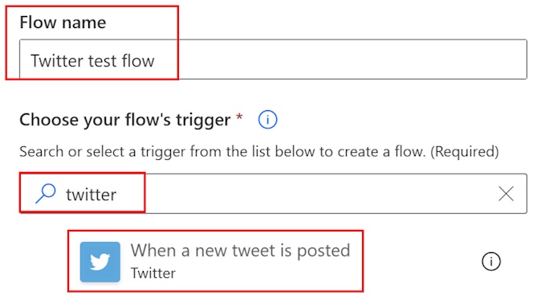
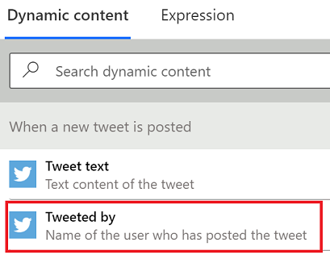

# Create a cloud flow in Power Automate

Create a cloud flow that performs one or more tasks automatically after it's triggered by an event. For example, create a cloud flow that notifies you by email when someone sends a tweet that contains a keyword you specify. In this example, sending a tweet is the event, and sending mail is the action.

## Prerequisites

* An account on [Power Automate](https://make.powerautomate.com)
* A Twitter account
* Office 365 credentials

## Specify an event to start the flow

When you create a cloud flow, your flow opens in either the current designer or the AI-powered designer. The instructions for ho to create a flow are slightly different for each designer. If you see the **Copilot** pane on the right, you're using the AI-powered designer. In this article, select the **Current designer** or **AI-powered designer** tab for instructions.

First, select what event, or *trigger*, starts your flow.

1. Sign in to [Power Automate](https://make.powerautomate.com).

1. From the navigation bar on the left, select **My flows**.

1. Select **New**, and then select **Automated-from blank**.

1. Give your flow a name in the **Add a name or we'll generate one** field.

1. Enter **Twitter** into the **Search all triggers** field.

1. Select **Twitter - When a new tweet is posted**.

   

1. Select the **Create** button at the bottom of the screen.

   > [!TIP]
   > Connectors support multiple types of authentication. For example, SQL Server supports Azure AD, SQL Server authentication, Windows authentication, and SQL connection string. Users choose which type of authentication they want to use when configuring a connector.

1. If you haven't already connected your Twitter account to Power Automate, select **Sign in to Twitter**, and then provide your credentials.

# [Current designer](#tab/current-designer)

In the **Search text** box, type the keyword that you want to find.

# [AI-powered designer](#tab/ai-powered-designer)

---

## Specify an action

# [Current designer](#tab/current-designer)

1. Select **New step**.

1. In the box that shows **Search connectors and actions**, enter **send email**, and then select **Send an email (V2)**.

    

1. If prompted, select the sign-in button, and then provide your credentials.

1. In the form that appears, enter your email address in the **To** box, and then select your name from the list of contacts that appears.

1. In the **Subject** box, enter **New tweet from:**, and then type a space.

    

1. In the list of tokens, select the **Tweeted by** token to add a placeholder for it.

    
1. Select the **Body** box, and then select the **Tweet text** token to add a placeholder for it.

   Optionally, you can add more tokens, other text, or both to the body of the email.
1. Near the top of the screen, select **Save**.

## Test your flow

Send a tweet with the keyword that you indicated, or wait for someone else to post such a tweet.

Within a minute after the tweet is posted, an email message notifies you of the new tweet.

> [!TIP]
> Use the **Send email (V2)** action to format email in which you customize the font, use bold, italic or underline, customize the color and highlight, and create lists or links, and more.

# [AI-powered designer](#tab/ai-powered-designer)

---

## Manage a cloud flow

1. Sign in to [Power Automate](https://make.powerautomate.com).

1. In the navigation bar on the left, select **My flows**.

1. In the list of flows, do any of the following:

   * To pause a cloud flow, set its toggle to **Off**.

       
   * To resume a cloud flow, set its toggle to **On**.

       
   * To edit a cloud flow, select the pencil icon that corresponds to the flow you want to edit.

       
   * To delete a cloud flow, select the **...** icon, select **Delete**, and then select **Delete** on the message box that appears.

       
   * To view the run history of a cloud flow, select the flow from the **My flows** page, and then view the history under the **28 day run history** section of the page that opens.

       

     Select a cloud flow run from the list of runs to see the inputs and outputs of each step.

> [!NOTE]
> You can have up to 600 flows in your account. If you already have 600 flows, delete one before you create another flow.

## Next steps

* [Add steps](multi-step-logic-flow.md), such as different ways to be notified, to your flow.
* [Run tasks on a schedule](run-scheduled-tasks.md), when you want an action to occur daily, on a certain date, or after a certain number of minutes.
* [Add a cloud flow to an app](/power-apps/maker/canvas-apps/using-logic-flows)
* [Get started with team flows](create-team-flows.md) and invite others to collaborate with you to design flows.

[!INCLUDE[footer-include](includes/footer-banner.md)]
