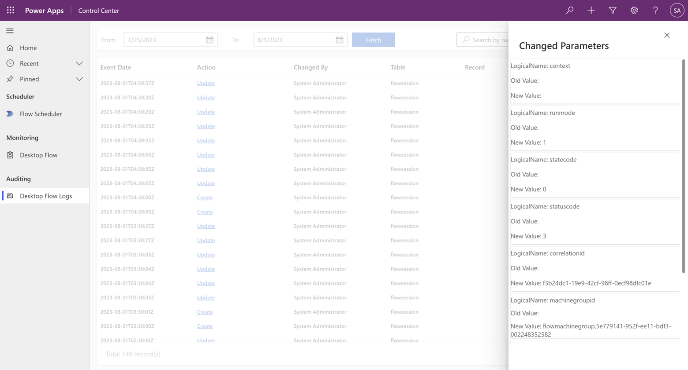

# Control Center Desktop Flow Audit Logs

The Control Center Desktop Flow Audit Logs feature allows you to retrieve audit data for Power Automate Desktops. Audit logs can be configured for specific Dataverse tables, providing valuable insights into activities related to [flowsession](/power-apps/developer/data-platform/reference/entities/flowsession), [flowmachine](/power-apps/developer/data-platform/reference/entities/flowmachine), [flowmachinegroup](/power-apps/developer/data-platform/reference/entities/flowmachinegroup), [workqueue](/power-apps/developer/data-platform/reference/entities/workqueue), [workqueueitem](/power-apps/developer/data-platform/reference/entities/workqueue), [desktopflowmodule](/power-apps/developer/data-platform/reference/entities/desktopflowmodule), [desktopflowbinary](/power-apps/developer/data-platform/reference/entities/desktopflowbinary), [flowmachineimage](/power-apps/developer/data-platform/reference/entities/flowmachineimage), [flowmachineimageversion](/power-apps/developer/data-platform/reference/entities/flowmachineimageversion), and [flowmachinenetwork](/power-apps/developer/data-platform/reference/entities/flowmachinenetwork).

>[!div class="mx-imgBorder"]
> 

## Prerequisites

Before using Control Center Desktop Flow Audit Logs, make sure to complete the following prerequisites:

1. **Configure Audit for an Environment**: To set up auditing, follow the instructions in the [Microsoft documentation](https://learn.microsoft.com/en-us/power-platform/admin/manage-dataverse-auditing#configure-auditing-for-an-environment).

2. **Configure Auditing for Tables and Columns in Power Apps**: To enable auditing for specific tables and columns in Power Apps, refer to the [Microsoft documentation](https://learn.microsoft.com/en-us/power-platform/admin/manage-dataverse-auditing#configure-auditing-for-one-or-more-tables-and-columns-in-power-apps).

3. **Add Users to Desktop Flows Support Analyst Role**: The Control Center installs a new role called **Desktop Flows Support Analyst**. Users need to be added to this custom security role to get access to the provision of new Audit logs.

## Default Audit Logs Data

By default, the Audit Logs will load data for the last one week. However, you have the flexibility to filter logs based on specific dates and view all changed attributes.

## Learn More

To learn more about configuring auditing and utilizing Control Center Desktop Flow Audit Logs, check out the following Microsoft documentation:

- [Configure Auditing for an Environment](https://learn.microsoft.com/en-us/power-platform/admin/manage-dataverse-auditing#configure-auditing-for-an-environment)

- [Configure Auditing for Tables and Columns in Power Apps](https://learn.microsoft.com/en-us/power-platform/admin/manage-dataverse-auditing#configure-auditing-for-one-or-more-tables-and-columns-in-power-apps)

With Control Center Desktop Flow Audit Logs, you can gain valuable insights into your Power Automate Desktops' activities and ensure better traceability and compliance.
