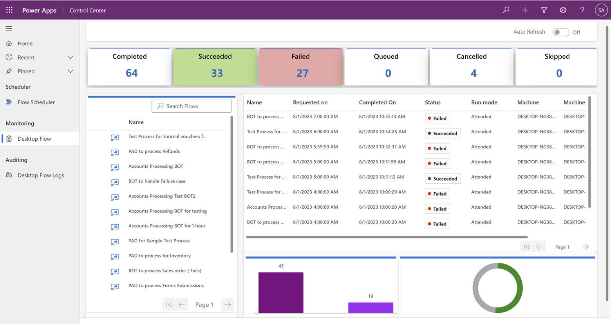

# Control Center Desktop Flow Monitoring

In the Automation Kit, the Control Center offers comprehensive Desktop Flow Monitoring capabilities, allowing users to check the health of all running processes. This monitoring feature provides users with the option to view the overall status of processes at a general level and also provides the ability to drill down to individual process details.

>[!div class="mx-imgBorder"]
> 

## Accessing Desktop Flow Monitoring

To access the Desktop Flow Monitoring features, follow these steps:

1. Click on the **Monitoring** tab in the Control Center interface.
2. Select **Desktop Flows** to access the monitoring dashboard specifically tailored for desktop flow processes.

## Detailed Run Log and Transactional Data

The monitoring dashboard provides detailed run logs and transactional data for all desktop flow processes. Users can visualize the performance and status of each process, including the number of successful and failed executions.

## Default Data Loaded for Last 1 Day

By default, the monitoring dashboard loads data for the last 1 day. Users can easily analyze the recent performance of their desktop flow processes without the need to manually adjust the date range.

## Auto Refresh with 60-Second Cadence

The monitoring dashboard supports an auto-refresh feature with a cadence of 60 seconds. This allows users to stay up-to-date with real-time data, ensuring they have the latest insights into the performance of their desktop flow processes.

## Visualize and Filter at Individual Process Level

With the Control Center's Desktop Flow Monitoring, users can easily visualize and filter data at the individual process level. This capability enables users to focus on specific processes and gain in-depth insights into their performance.

By leveraging the Desktop Flow Monitoring feature, users can efficiently manage and optimize their desktop flow processes, ensuring smooth and reliable automation within their organization.
