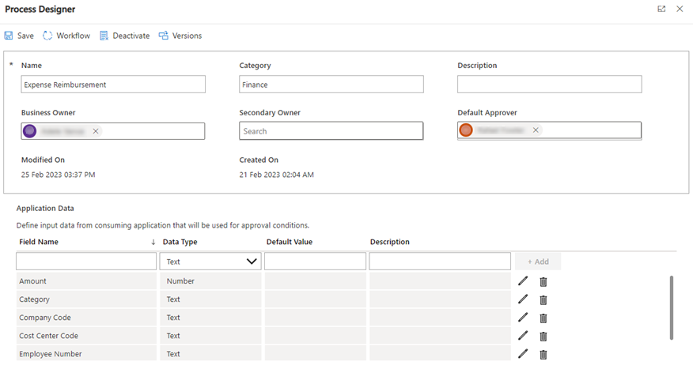
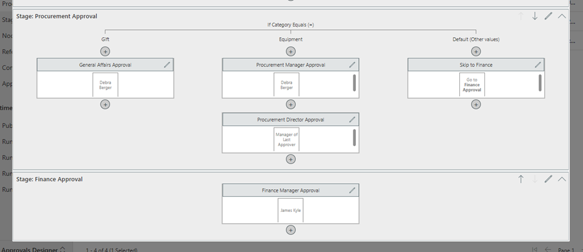

# Configuring preset approvals

Approvals Kit allows you to predefine approval workflows so that you don't need to set up each approver manually.

To configure preset approvals, you must set up the:

- Approvals Process

- Application Data

- Stage

- Condition (Optional)

- Node

- Approver

## Define Processes

First step of configuring preset approvals is to set up Processes. Processes are where all information related to the particular approval process is defined.

1. Go to **make.powerapps.com**

1. Select **Apps** and select **Business Approval Management**

1. Opening the application for the first time prompts you to give consent to the Office 365 connector

1. Switch to Approvals Designer on bottom left corner of the screen

   

1. Select **Processes**

1. Select **New (Process Designer)**

1. Enter the **Name** of the process, **Category** (optional) and **Description** (optional)

1. In the **Default Approver,** start typing the name and select from list

1. Select **Save**

## Define Application Data

In a typical approval request, you often need to also submit information about the approval. For example amount, project category, department, accommodation, chart of account number, cost center code etc.

Approvals Kit allows you to use these types of data from Power Platform, other applications and systems. You use data retrieved from via connectors or manually enter the data when making the actual request. To use the data in your approval process, you can define them in Application Data.

1. Enter **Field Name**

1. Select **Data Type** from the following:

   - Text

   - Number

   - Boolean

   - Date/Time

   - User (Email) - Can be used as approval user

1. Enter **Default Value** (optional)

1. Enter **Description** (optional)

1. Select **+ Add**

1. Repeat steps until you have added all application data

## Define Workflow Stages and Nodes

In Approvals Kit, you can define stages in a workflow process. Each stage then a minimum of one stage is required even for a simple workflow. Each stage then includes at least one _node_. Node is where you define who is going to be the actual approver. You may define multiple nodes within one stage, and each node is run sequentially.

After the first stage is defined, you can add more stages that have conditions where you can branch out to different nodes for sophisticated scenarios.

### Define the first workflow stage

1. Select **Workflow**

1. Select **New Stage**

1. Enter **Name** and **Description**

1. Select **Save & Back**

### Define the first node

Once you have defined your first stage, you optionally can add the first node.

1. Select the (**+)** sign.

1. Enter **Name** and **Description**

1. Select the **Approval Type**

    a.  **Approve/Reject - Everyone must approve** When choosing this option, every person included in this node has to approve to proceed to the next steps.

    b.  **Approve/Reject - First to respond** When choosing this option, only a single person included in this node has to approve to proceed to the next steps.

    c.  **Custom Responses - Wait for all responses** When choosing this option, you can define multiple responses beyond the Approve/Decline. Every person included in this node has to respond to proceed to the next steps.

    d.  **Custom Responses - Wait for one response** When choosing this option, you can define multiple responses beyond the Approve/Decline. Only a single person included in this node has to respond to proceed to the next steps.

1. Select either **User** or **Dynamic**

    a.  **User** - you can select a specific user/employee

    b.  **Dynamic** - the user information is automatically retrieved and set as approver
    
    - **Manager of Initiator** - Information of whoever started the approval request will be used to identify the manager automatically and be assigned as approver

    - **Manager of \[Request data field\]** - Email address of a field you specified in Application Data step will be used to identify the manager automatically and be assigned as approver. The field must be defined as Email type to select this option.

    - **Manager of Last Approver** - Information of the last approver is automatically retrieved to identify the manager automatically and be assigned as approver.

    - **Use Request Data Field** - Email address of a field you specified in Application Data step will be used directly.

1. Select **Notification**

    a.  Default

    b.  None

1. Select **Delegation Rule**

    a.  **None** - No delegation settings set by the approver are applied to this workflow

    b.  **Time-out** - Delegation settings set by the approver are automatically be applied if the approver assigned doesn't respond within the number of days defined

    c.  **Out of Office** - Delegation settings set by the approver are automatically applied if the approver is out of office at the time the approval is received

    d.  **Time-out or Out of Office** - Delegation settings set by the approver are automatically applied either if the approver assigned doesn't respond within the number of days defined, or if the approver is out of office at the time the approval is received

1. Select **Time Out Setting**

    a.  ***Actual Days*** - The timeout calculation is the actual number of days since the node has started, and doesn't take holidays into consideration.

    b.  ***Business Days*** - The timeout calculation considers the number of business days that has passed based on the approvers work profile settings, and company holiday settings.

1. Select **Save & Back**

1. Repeat steps if you would like to add more nodes in the same Stage.

*Note: You don't need to specify only one approver in each node and may add multiple approvers together in a single node.*

Example screenshot showing a scenario where only one response either from Alan Steiner, Manager of Initiator or Alicia Thomber is required

### Adding conditional stage - Switch Condition

After adding the first stage of the workflow, you can add conditional approval by defining conditions in stages. Switch condition is where you may have 2-5 different paths that flow to depending on the condition.

1. Select **Add Stage**

1. Enter **Name** and **Description**

1. Change **Condition** to Switch

1. Select the number of **Paths**

1. Select **Source**

    a.  **Request Data** - the system automatically retrieves the
        application data from the approval request to use as condition

    b.  **Previous Node Outcome** - the system automatically
        retrieves the outcome of the previous node (such as
        Approve/Reject or any custom options you defined) to use as
        condition

1. Fill in the options for each path

    a.  Select either **Static value** or **Request Data**

    - **Static value** - you must define the condition yourself

    - **Request Data** - the system will compare the Request
            Data defined in step 5 against what request data you define
            here

#### Example

Example here shows a scenario where expense approval branches off to different nodes depending on what expense reimbursement category was selected in the original request.

Once defined, the Process Configurator shows three paths to add Nodes to. Below shows if Gift is selected, Jamie from General Affairs is the approver, and if Equipment is selected, Karen from Procurement is the first approver, followed by her manager (Procurement Director). If neither option is selected, it will go to the next stage

### Adding conditional stage - If/Else Condition

After adding the first stage of the workflow, you can add conditional approval by defining conditions in stages. If/Else condition is where you may have specific requirement (For example amount greater than 5000 USD, company code starts with 10 etc.)

1. Select **Add Stage**

2. Enter **Name** and **Description**

3. Change **Condition** to If/Else

4. Select **Source**

    a.  ***Request Data*** - the system automatically retrieves the application data from the approval request to use as condition

    b.  ***Previous Node Outcome*** - the system automatically retrieves the outcome of the previous node (such as Approve/Reject or any custom options you defined) to use as condition

5. Select Operand - Changes depending on what type of data you select in step 4.

6. Fill in the condition

    a.  Select either **Static value** or **Request Data**

    - **Static value** - you must define the condition yourself

    - **Request Data** - the system will compare the Request
            Data defined in step 4 against what request data you define
            here

#### Example

Example here shows a scenario where expense approval branches off to two paths depending on the amount of expense reimbursement requested is greater than or equal to 5000 USD.

## Publishing workflow

Once you have finished configuring workflows, you need to publish the
workflow to be able to use it. The system automatically checks and
validates that you have configured the workflows without any errors.

1. Open process you want to publish

1. Select Workflows

1. Select **Publish**

1. Select **Yes** for **Activate process when published**

1. Select **Publish**

Once you select publish, a new version is stored and the system begins the publishing process. When complete, the system shows the **Activation status** as **Active**.

You're now ready to take in approval requests.
