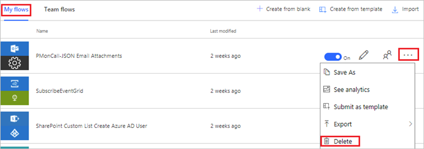

# Respond to personal data deletion requests (Microsoft account)

[!INCLUDE [gdpr-intro](~/../msft-shared-content/privacy-includes/gdpr-intro.md)]

[!INCLUDE [gdpr-dsr-delete-note](~/../msft-shared-content/privacy-includes/gdpr-dsr-delete-note.md)]

The right to erasure allows data subjects to request the removal of their personal data, including system-generated logs but not audit logs, from an organization's customer data. Also, when a user leaves your organization, an admin must determine whether to delete data and resources that the user created as part of their Power Automate flows. Other personal data is automatically deleted when the user's Microsoft account is [closed](privacy-dsr-accountclose-msa.md).

The following table shows which personal data is automatically deleted, and which data requires an administrator to manually review and delete, for users who authenticate using a Microsoft account.

| Requires the user to review and delete | Automatically deleted |
| ------ | ------ |
| Product and service activity | Run history |
| Flows | Activity Feed |
| Connections | |

## Delete personal data

The following steps describe how to self-serve data deletion requests.

### Delete product and service activity

1. Sign in to the [Microsoft Privacy Dashboard](https://account.microsoft.com/privacy/) with your Microsoft account.

1. Select **Activity history**.

1. Search or browse your activity history for the Microsoft applications and services that you use, including Power Automate.

1. Select **Delete** to remove specific product or service activity events.

    :::image type="content" source="media/privacy-dsr-delete-msa/deleteevent.png" alt-text="Screenshot of deleting Power Automate events in the Microsoft Privacy Dashboard.":::

### List and delete flows

1. Sign in to [Power Automate](https://flow.microsoft.com), and then select **My flows**.

1. In the list of flows, select the flow menu (**&hellip;**) for the flow you want to delete, and then select **Delete**.

    

### Delete connections

Connections include references to the user who creates them. You can delete these references at any time.

1. Sign in to [Power Automate](https://flow.microsoft.com), select the gear icon in the upper-right corner of the window, and then select **Connections**.

1. Select the connection that you'd like to delete, select the menu (**&hellip;**), and then select **Delete**.

1. Select **Delete** when you're prompted to confirm you want to delete the connection.

> [!NOTE]
> If other flows use the connection you're deleting, you're notified that a new connection is required. Otherwise, select **Delete** to continue.

## Learn more

* Get started with [Power Automate](getting-started.md)
* Learn [what's new](release-notes.md) with Power Automate

[!INCLUDE [footer-include](includes/footer-banner.md)]
